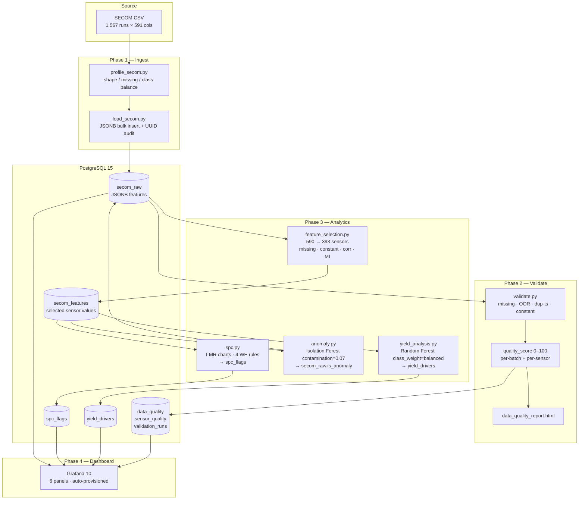

# SENTINEL
### Manufacturing Process Monitoring & Yield Analytics

> A production-grade data engineering and ML pipeline built on the UCI SECOM semiconductor manufacturing dataset. Demonstrates end-to-end ownership of data ingestion, statistical process control, predictive modelling, and real-time operational dashboards — the core skills of a Technical Program Manager in hardware/silicon development.

---

## Architecture



---

## Components

| Layer | File(s) | Output |
|-------|---------|--------|
| **Ingest** | `pipeline/ingest/load_secom.py` | 1,567 rows in `secom_raw` (JSONB sensor columns + UUID audit) |
| **Profile** | `pipeline/ingest/profile_secom.py` | Console: shape, missing rate, class imbalance |
| **Validate** | `pipeline/transform/validate.py` | `data_quality`, `sensor_quality`, `validation_runs` tables |
| **Quality report** | `scripts/generate_quality_report.py` | `data/exports/data_quality_report.html` |
| **Feature selection** | `pipeline/transform/feature_selection.py` | `secom_features` table + `selected_features.csv` |
| **SPC** | `pipeline/analytics/spc.py` | `spc_flags` table (I-MR, 4 Western Electric rules) |
| **Anomaly** | `pipeline/analytics/anomaly.py` | `secom_raw.anomaly_score` + `.is_anomaly`; `anomaly_summary.csv` |
| **Yield model** | `pipeline/analytics/yield_analysis.py` | `yield_drivers` table + `yield_feature_importance.csv` + `yield_model_report.txt` |
| **Dashboard** | `grafana/dashboards/sentinel_overview.json` | 6 live Grafana panels |
| **ERD** | `scripts/generate_erd.py` | `docs/erd.png` |
| **Health check** | `scripts/final_check.py` | 15-point system verification |

---

## Database Schema

| Table | Rows (after full pipeline) | Key Columns |
|-------|---------------------------|-------------|
| `secom_raw` | 1,567 | `id`, `timestamp`, `label`, `features` (JSONB), `batch_id`, `anomaly_score`, `is_anomaly` |
| `secom_features` | 1,567 | `raw_id` (FK), `features` (JSONB, selected sensors only) |
| `data_quality` | ≥1 per run | `batch_id`, `quality_score`, `missing_pct`, `oor_pct`, `dup_ts_count`, `constant_sensor_count` |
| `sensor_quality` | ~393 per run | `sensor_name`, `quality_score`, `missing_pct` |
| `validation_runs` | 1 per `make validate` | `batch_id`, `validated_at`, `quality_score` |
| `spc_flags` | ~400 | `sensor_name`, `ts`, `rule_number`, `rule_desc`, `value`, `ucl`, `lcl` |
| `yield_drivers` | 10 | `rank`, `sensor_name`, `importance_score`, `mi_score` |
| `model_runs` | ≥1 | `run_id`, `model_type`, `params`, `created_at` |
| `predictions` | 1,567 | `raw_id`, `run_id`, `predicted_label`, `probability` |
| `yield_metrics` | ≥1 | `run_id`, `metric_name`, `metric_value` |

---

## Tech Stack

| Component | Technology | Version |
|-----------|------------|---------|
| Database | PostgreSQL | 15-alpine |
| Dashboard | Grafana | 10.2.0 |
| Container orchestration | Docker Compose | 3.9 |
| Language | Python | ≥3.12 |
| Data manipulation | pandas | ≥2.2 |
| Numerical | NumPy | ≥1.26 |
| ML | scikit-learn | ≥1.4 |
| DB driver | psycopg2-binary | ≥2.9 |
| Visualisation | matplotlib | ≥3.8 |
| Testing | pytest | ≥8.0 |

---

## Quick Start

**Prerequisites:** Docker Desktop, Python ≥3.12, `make`

```bash
# 1. Clone and enter the project
git clone <repo-url> SENTINEL && cd SENTINEL

# 2. Copy the env template (no changes needed for local dev)
cp .env.example .env

# 3. Start the database and Grafana
make up

# 4. Create the Python virtual environment and install deps
make venv

# 5. Run the full pipeline end-to-end
make ingest        # load 1,567 SECOM records
make validate      # data quality checks + HTML report
make analytics     # feature selection → SPC → anomaly → yield model

# 6. Open the dashboard
make dashboard-check   # verifies health + opens browser

# 7. (Optional) run all tests
make test
```

**All 15 system checks in one command:**

```bash
python scripts/final_check.py
```

---

## Makefile Reference

| Target | What it does |
|--------|--------------|
| `make up` | Start PostgreSQL + Grafana via Docker Compose |
| `make down` | Stop all containers |
| `make venv` | Create `.venv` and install `requirements.txt` |
| `make migrate` | Apply DB migrations 001–004 |
| `make ingest` | Profile + load SECOM data into `secom_raw` |
| `make validate` | Run quality checks; write scores to DB |
| `make quality-report` | Generate `data/exports/data_quality_report.html` |
| `make feature-select` | Run 4-step feature selection; populate `secom_features` |
| `make spc` | Compute I-MR limits; write SPC flags to DB |
| `make anomaly` | Train Isolation Forest; update `secom_raw` |
| `make yield-analysis` | Train Random Forest; write `yield_drivers` |
| `make analytics` | `feature-select` → `spc` → `anomaly` → `yield-analysis` |
| `make erd` | Generate `docs/erd.png` from live schema |
| `make dashboard-check` | Verify Grafana health + panel count + open browser |
| `make test` | Run 67 unit tests with pytest |
| `make clean` | Remove `.venv` and `data/exports/` |

---

## Dashboard Panels

See [DASHBOARD.md](DASHBOARD.md) for a full ops-reader guide.

| Panel | Type | Data source |
|-------|------|-------------|
| Yield Trend Over Time | Time series | `secom_raw` (weekly pass/fail counts) |
| Data Quality Score | Stat | `validation_runs` (latest quality score) |
| Anomaly Summary | Stat | `secom_raw` (total anomaly flags) |
| Sensor Health Ranking | Bar chart | `sensor_quality` (bottom-20 by avg quality score) |
| Anomalous Readings | Table | `secom_raw` (rows where `is_anomaly = true`) |
| SPC Events | Table | `spc_flags` (all Western Electric violations) |

---

## Project Management

Full PM documentation lives in [`docs/pm/`](docs/pm/):

| Document | Description |
|----------|-------------|
| [wbs.md](docs/pm/wbs.md) | Work breakdown structure with estimated vs actual hours (45.5 h est / 51.5 h actual) |
| [milestones.md](docs/pm/milestones.md) | 7-milestone table with Mermaid Gantt chart |
| [risk_register.md](docs/pm/risk_register.md) | 8 risks identified and closed; all mitigated before corresponding milestone |
| [week1_status.md](docs/pm/week1_status.md) | Week 1 status report (Sep 7–12): Phases 0–2 |
| [week2_status.md](docs/pm/week2_status.md) | Week 2 status report (Sep 14–20): Phases 3–5 |
| [requirements.md](docs/pm/requirements.md) | FR-001–FR-013, 5 NFRs, out-of-scope items, acceptance criteria per phase |

---

## Key Design Decisions

**JSONB for sensor columns** — With 590 sparse sensor columns and ~5% missing cells, a wide table would be 590 nullable numeric columns. Storing `features` as JSONB makes the schema stable across datasets with different sensor counts while still supporting key-level indexing.

**I-MR over X-bar R** — SECOM has one measurement per wafer run (no natural subgroups). I-MR control charts estimate σ from moving ranges (MR̄/d₂, d₂=1.128), which is the correct SPC method for individual observations.

**Isolation Forest contamination=0.07** — The SECOM fail rate is 6.6% (104/1,567). Setting contamination slightly above the known failure rate ensures the model is calibrated to the real prevalence of anomalies.

**class_weight='balanced' with stratified split** — A 14:1 pass/fail imbalance means accuracy alone is misleading. Balanced class weighting upweights the minority (fail) class during training; stratified splitting preserves the ratio in the test set. The model output is framed as feature importances for yield correlation, not as a production predictor.

**Idempotent migrations** — Every migration uses `CREATE TABLE IF NOT EXISTS` and `ADD COLUMN IF NOT EXISTS`. The `TRUNCATE … CASCADE` + `INSERT` pattern on ingest ensures re-running the pipeline is always safe.

---

## Dataset

[UCI SECOM Dataset](https://archive.ics.uci.edu/dataset/179/secom) — Semiconductor manufacturing process monitoring data.

| Attribute | Value |
|-----------|-------|
| Records | 1,567 wafer runs |
| Sensors | 590 process measurements |
| Label | Binary: −1 (pass) / +1 (fail) |
| Date range | 2008-01-10 to 2008-07-04 |
| Fail rate | 6.6% (104 fail / 1,463 pass) |
| Missing cells | ~5.4% overall; individual sensors up to 80%+ |
