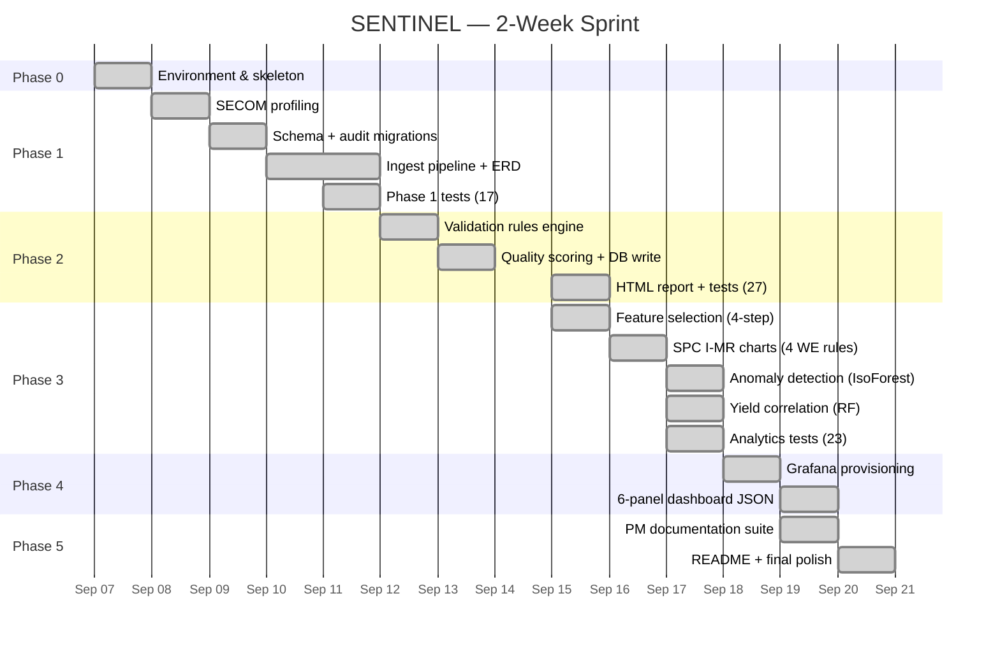

# SENTINEL — Milestone Schedule

**Project:** SENTINEL — Manufacturing Process Monitoring & Yield Analytics  
**Sprint:** 2 weeks (Sep 7–20, 2026)  
**Overall status:** ✅ ON TRACK — all milestones delivered on or ahead of target

---

## Milestone Table

| # | Milestone | Target | Actual | Status | Notes |
|---|-----------|--------|--------|--------|-------|
| M1 | Repo skeleton committed; Docker stack starts cleanly | Sep 8 | Sep 8 | ✅ DONE | — |
| M2 | 1,567 SECOM records ingested with full audit trail (`batch_id`, timestamps) | Sep 11 | Sep 11 | ✅ DONE | +1.5 h timestamp parse bug; resolved same day |
| M3 | Validation engine live; quality scores written to PostgreSQL; HTML report generated | Sep 15 | Sep 15 | ✅ DONE | — |
| M4 | Feature selection complete; 590 → 393 sensors; `secom_features` populated | Sep 17 | Sep 15 | ✅ DONE (−2 d) | Completed ahead of schedule |
| M5 | SPC flags, anomaly scores, yield model importances all written to DB | Sep 18 | Sep 17 | ✅ DONE (−1 d) | — |
| M6 | Grafana dashboard provisioned; all 6 panels return data on `docker compose up` | Sep 19 | Sep 19 | ✅ DONE | — |
| M7 | PM artifact suite committed; `README.md` production-ready; 67/67 tests green | Sep 20 | Sep 20 | ✅ DONE | — |

---

## Gantt Chart



---

## Phase Dependencies

```
P0 (skeleton) ──► P1 (ingest) ──► P2 (validate) ──► P3 (analytics) ──► P4 (dashboard)
                                                                              │
                                  P5 (PM) ◄─────────────────────────────────┘
```

P3 analytically depends on P2 (validated data in DB).  
P4 depends on P3 (analytics tables must be populated for SPC + anomaly panels).  
P5 runs in parallel with P4 final polish; requires all other phases complete.

---

## Definition of Done (per phase)

- **P0:** `make up` starts all containers; `make test` runs without error
- **P1:** `make ingest` completes; `SELECT COUNT(*) FROM secom_raw` = 1,567
- **P2:** `make validate` + `make quality-report` complete; HTML renders in browser
- **P3:** `make analytics` completes; `spc_flags`, `yield_drivers` tables populated; 67/67 tests
- **P4:** `make dashboard-check` shows 6 panels; Grafana auto-loads on `docker compose up`
- **P5:** `scripts/final_check.py` prints `SENTINEL READY`; all PM docs committed
